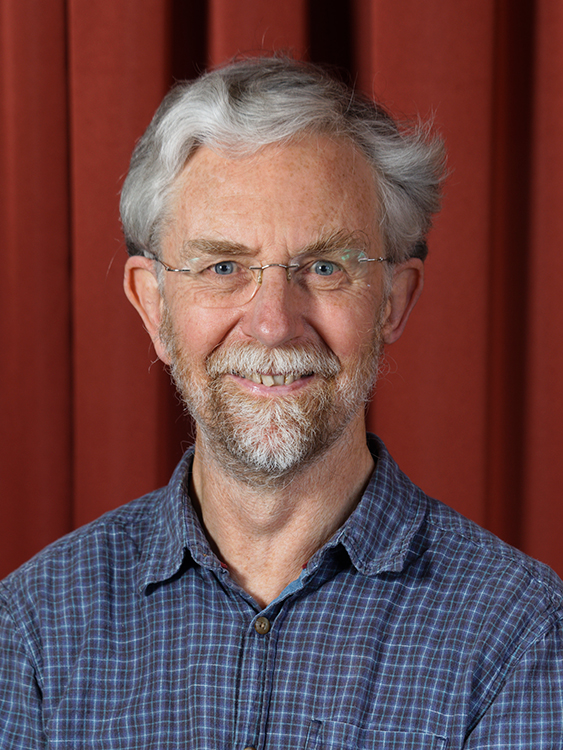

[Professor Alan Mycroft](https://www.cl.cam.ac.uk/~am21/) is well-known for his many pioneering contributions to programming language theory and applications, both design and implementation, ranging from compilation and optimization techniques and type systems, to parallel, concurrent and dataflow programming, but also for his work as a co-founder of the Raspberry Pi Foundation. To those who worked with Alan, he is renowned for his unstoppable enthusiasm about any challenging problem related to programming and computers, making him an inspiring teacher, mentor, and collaborator.

To celebrate Alan's retirement, there will be a hybrid event in the early winter (1st December) with talks given from those contributing submissions both of a technical and personal nature. In early 2024 we will publish a Festschrift to mark the occasion, with a submission deadline of 31st January.

<!-- More details can be found here: [https://dorchard.github.io/mycroftfest](https://dorchard.github.io/mycroftfest) -->

# Symposium

The event will be on the 1st of December in FW26 of the [William Gates Building (Computer Laboratory), University of Cambridge](https://www.google.com/maps/place/Computer+Laboratory/@52.210891,0.0891517,17z/data=!3m1!4b1!4m6!3m5!1s0x47d8774a3f6e55cd:0xabf8227343e684c7!8m2!3d52.210891!4d0.091732!16zL20vMDJtN2xj?entry=ttu).

[Registration](https://docs.google.com/forms/d/e/1FAIpQLScjsZc8PNVVkdjPHyPiLt4d6l3Yj60oQDbZUCklwhPwub7dTA/viewform). Please register by the 10th November if you intend to join the event.

## Schedule

### Introduction

* 09:00-09:10 - Welcome from the organisers (__Dominic Orchard__, __Tomas Petricek__, __Jeremy Singer__)
* 09:10-09:15 - Welcome from the Head of Department (__Alastair Beresford__)

### Static analysis and compilation

* 09:15-09:30 - (15 min) On the NorCroft compiler (__Jeremy Singer__)
* 09:30-09:55 - (25 min) Static Analysis for Hardware Design (Mads Rosendahl, Maja Kirkeby)
* 09:55-10:15 - (20 min) When Obfuscations Preserve Constant-Time (Matteo Busi, __Pierpaolo Degano__, Letterio Galletta)
* 10:15-10:35 - (20 min) No Need to Imply Anything (__Paulo Torrens__)
* 10:35-11:00 - Coffee

### Monads, comonads, and grades

* 11:00-11:30 - (30 min) Comonadic notions of computation revisited (__Tarmo Uustalu__)
* 11:30-12:00 - (30 min) A Tale of Two Graded Calculi: The Marriage of Coeffects and Graded Comonads (__Vilem Liepelt__, Daniel Marshall, Dominic Orchard)
* 12:00-12:30 - (30 min) How to construct graded monads (__Dylan McDermott__)

### Lunch

* 12:30-13:30 - Lunch

### Post lunch 

* 13:30-13:40 - (10 min) - Recollections of Alan's early career (__Ken Moody__)

### Programming languages and systems

* 13:40-14:10 - (30 min) Linearity, Uniqueness, Ownership: An Entente Cordiale (__Daniel Marshall__)
* 14:10-14:35 - (25 min) Sustainable software development - new challenges for programming, programming language design, compiler construction and program analysis (__Bent Thomsen__, Lone Leth Thomsen, Thomas Bøgholm)
* 14:35-15:00 - (25 min) A Symbolic Computing Perspective on Software Systems (Arthur Norman, Stephen Watt)
* 15:00-15:20 - (20 min) Programming systems deserve a theory too! (Tomas Petricek, Joel Jakubovic)

* 15:20-15:50 - Coffee

### Performance, parallelism, and the real world

* 15:50-16:10 (20 min) Air quality big data analytics using low-cost sensors (__Eleftheria Katsiri__)
* 16:10-16:40 (30 min) Parallel Multiprecision Arithmetic the Easy Way (Cosmin Oancea, Stephen Watt)
* 16:40-17:05 (25 min) axs: a workflow automation language for omni-benchmarking and optimization (__Anton Lokhmotov__, Leo Gordon, Alastair Donaldson)
* 17:05-17:35 (30 min) Triemaps that match (Simon Peyton Jones, Sebastian Graf)

### Closing

* 17:35-17:40 (5 mins) Closing remarks (Dominic Orchard, Tomas Petricek, Jeremy Singer)

## Festschrift

We intend to publish a festschrift (publishers to be confirmed) after the event.  We solicit original contributions in all areas of programming language research, including clever hacker tricks, beautiful mathematical theories, practically useful programming techniques, novel language design ideas, and visions for the future of education and programming technology. Just as Alan does not fit any pre-existing well-defined box, we invite contributions outside the established boxes that cover a wide range of areas and use a wide range of styles. The only criteria is academic interest and novelty and a connection to Alan's own work. 

<!-- Furthemore, we would also happily receive talk proposals of a more informal nature, for example, to talk about previous collaborations with Alan or early interactions. -->

We are extending this invite to all of Alan's previous students, colleagues, and collaborators and we would be happy for this to be shared widely.

Submissions should follow the LNCS formatting guidelines and should be at least 6 pages, but not typically exceeding 25 pages. All submissions will be reviewed by at least two expert reviewers that will be appointed by the special issue editors, drawn from within the community.

## Important dates (revised)

* ~~1st October - Deadline for submissions of talk abstracts or talk+paper abstracts on [EasyChair](https://easychair.org/conferences/?conf=mycroftfest23)~~
* ~~14th October - Notification for talk abstracts (__we don't anticipate turning anyone away!__)~~
* 5th November - Deadline for any paper drafts to compile informal proceedings (though if you would like to submit to the Festschrift you need not submit a draft at this point).
* 10th November - [Registration](https://docs.google.com/forms/d/e/1FAIpQLScjsZc8PNVVkdjPHyPiLt4d6l3Yj60oQDbZUCklwhPwub7dTA/viewform) deadline.
* 1st December - Event in Cambridge (FW26, Department of Computer Science and Technology) and hybrid
* 31st January - post-proceedings Festschrift deadline

## Organisers and Festschrift editors

- Dominic Orchard, University of Kent and University of Cambridge ([dao29@cam.ac.uk](mailto:dao29@cam.ac.uk))
- Tomas Petricek, Charles University ([tomas@tomasp.net](mailto:tomas@tomasp.net))
- Jeremy Singer, University of Glasgow ([Jeremy.Singer@glasgow.ac.uk](mailto:Jeremy.Singer@glasgow.ac.uk))
